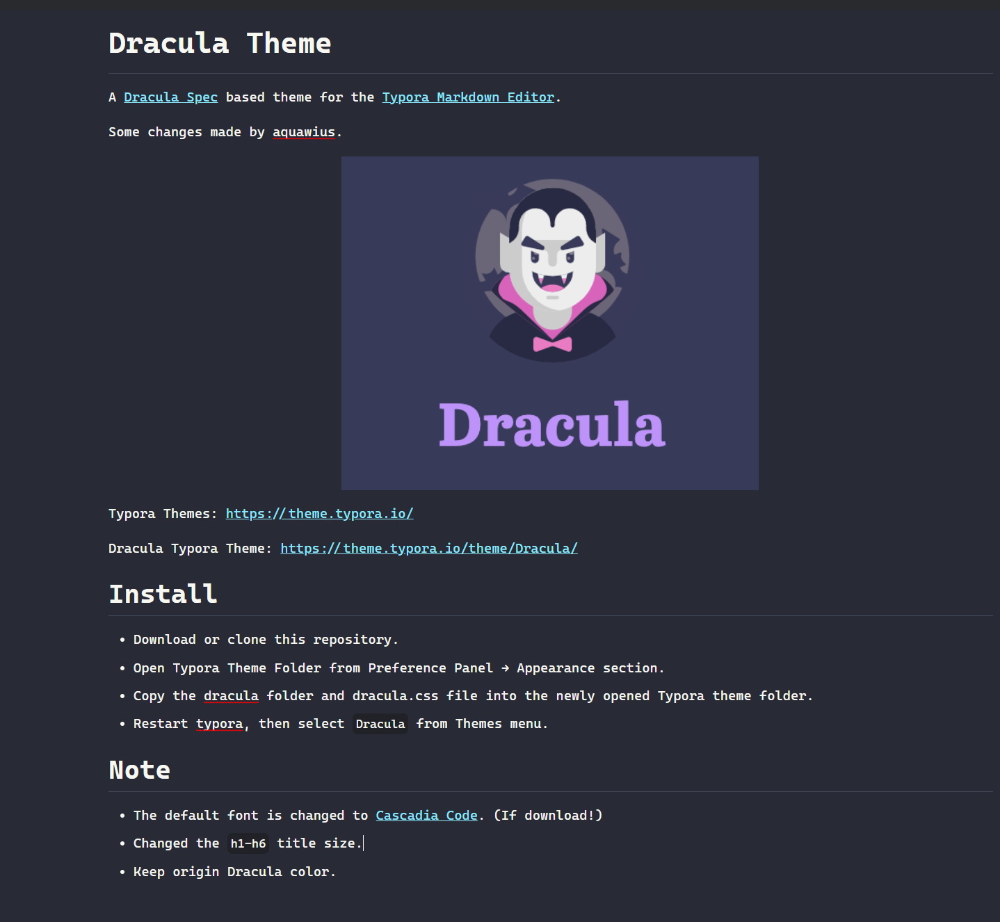
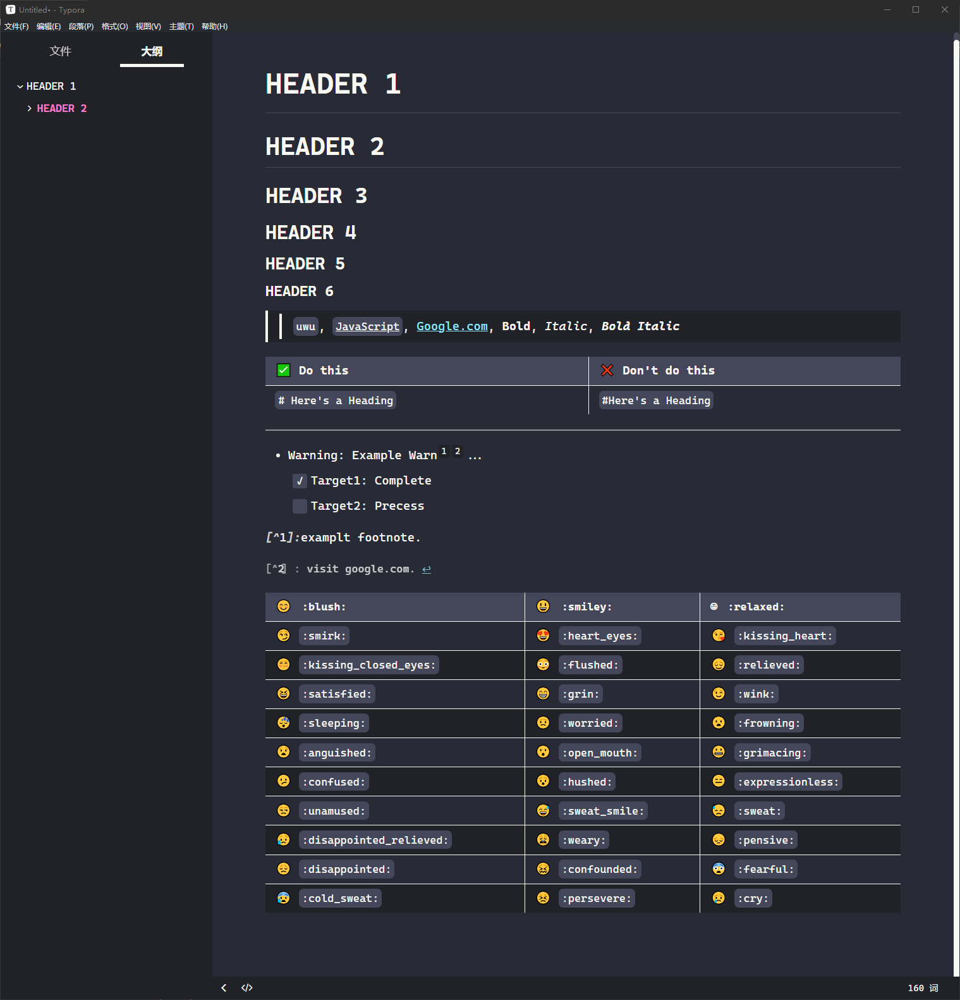
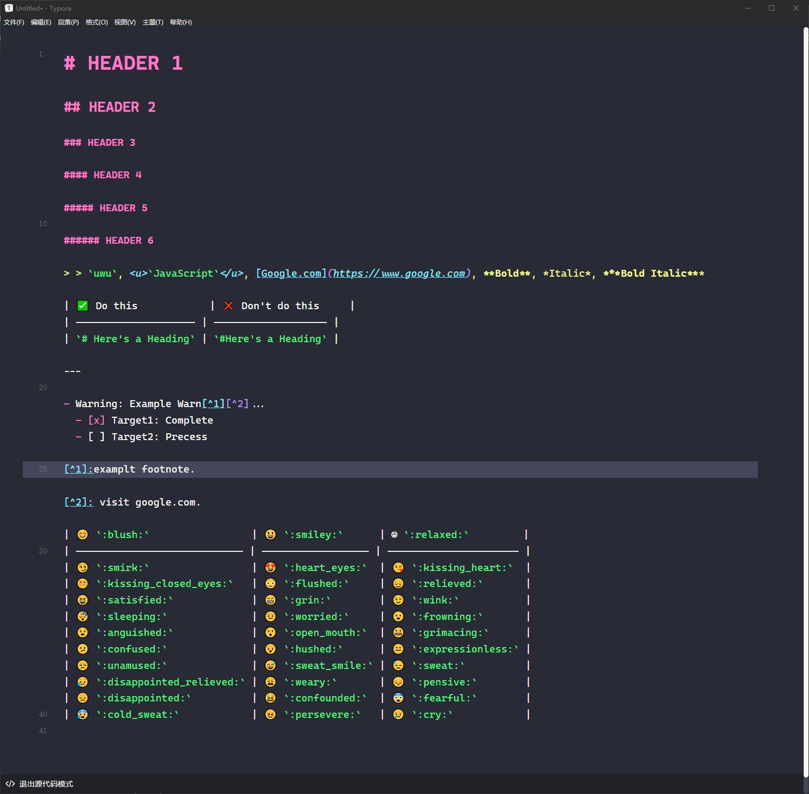
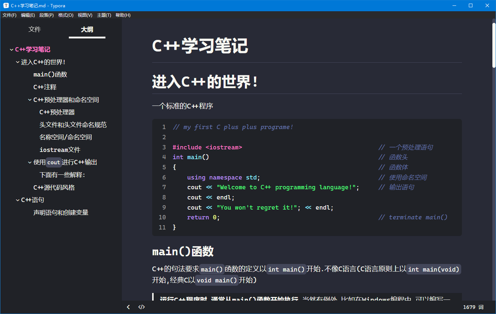

# Dracula Theme

A [Dracula Spec](https://draculatheme.com) based theme for the [Typora Markdown Editor](https://typora.io).

Some changes made by [aquawius](https://github.com/aquawius)(It's me).

Origin code here:
[Typora Dracula](https://theme.typora.io/theme/Dracula/) or [Github](https://github.com/Teyler7/dracula-typora-theme)

Typora Themes: https://theme.typora.io/

Dracula Typora Theme: https://theme.typora.io/theme/Dracula/

## Install

* Download or clone this repository.
* Open Typora Theme Folder from Preference Panel → Appearance section.
* Copy the dracula folder and dracula.css file into the newly opened Typora theme folder.
* Restart typora, then select `Dracula` from Themes menu.

## Screen shots

This readme.md page:

`Normal` mode:

`Source Code` mode:

`Actually working`:

## Note

- The default font is changed to [Cascadia Code NF / Cascadia Code](https://github.com/microsoft/cascadia-code) (Already includes woff2 font in dracula folder.). In theory, there is no need to install Cascadia Code manually.
- Cascadia Code's `Nerd Font` is used by default.
- Changed the `h1-h6` title size.
- Keep origin Dracula color series.

## License

[MIT license](https://gitee.com/aquawius/dracula-typora-theme/blob/master/LICENSE)
